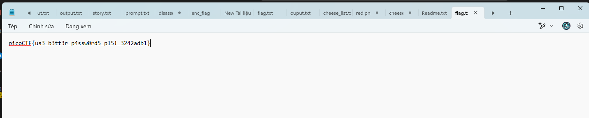

### **1. Xác định loại hash**
Hash của bạn trông giống như một **BitLocker recovery password hash**, và nó có thể được tấn công bằng **Hashcat** với mode `22100`.

---

### **2. Cách Crack Hash BitLocker bằng Hashcat**
#### **Yêu cầu:**
- Hashcat được cài đặt trên hệ thống (Linux hoặc Windows).
- GPU mạnh (NVIDIA/AMD) để tăng tốc độ bẻ khóa.
- Danh sách từ điển (wordlist) như **rockyou.txt** hoặc tự tạo.

#### **Lệnh để chạy Hashcat**
Nếu bạn sử dụng **Hashcat**, dùng mode `22100` để crack:

```bash
hashcat -m 22100 hash.txt wordlist.txt --force
```

Trong đó:
- `-m 22100`: Mode của Hashcat dành cho BitLocker.
- `hash.txt`: File chứa hash cần crack.
- `wordlist.txt`: File danh sách từ điển (ví dụ: `rockyou.txt`).

Nếu bạn muốn brute-force thử với tất cả các kết hợp, bạn có thể chạy:

```bash
hashcat -m 22100 hash.txt -a 3 ?a?a?a?a?a?a?a?a
```

Ở đây:
- `-a 3`: Chế độ brute-force.
- `?a?a?a?a?a?a?a?a`: Thử tất cả các ký tự với độ dài 8 ký tự.

Nếu bạn có GPU mạnh, bạn có thể tăng tốc độ với **OpenCL** bằng cách thêm `-w 4`:

```bash
hashcat -m 22100 hash.txt wordlist.txt -w 4

dungbv@DESKTOP-HA92R2F:~$ hashcat -m 22100 hash.txt rockyou.txt -w 4
hashcat (v6.2.5) starting

OpenCL API (OpenCL 2.0 pocl 1.8  Linux, None+Asserts, RELOC, LLVM 11.1.0, SLEEF, DISTRO, POCL_DEBUG) - Platform #1 [The pocl project]
=====================================================================================================================================
* Device #1: pthread-11th Gen Intel(R) Core(TM) i5-11400H @ 2.70GHz, 2851/5767 MB (1024 MB allocatable), 12MCU

Minimum password length supported by kernel: 4
Maximum password length supported by kernel: 256

Hashfile 'hash.txt' on line 1 (Encryp...itlocker-1.dd opened, size 100MB): Separator unmatched
Hashfile 'hash.txt' on line 2 (Salt: 2b71884a0ef66f0b9de049a82a39d15b): Separator unmatched
Hashfile 'hash.txt' on line 3 (RP Nonce: 00be8a46ead6da0106000000): Separator unmatched
Hashfile 'hash.txt' on line 4 (RP MAC: a28f1a60db3e3fe4049a821c3aea5e4b): Separator unmatched
Hashfile 'hash.txt' on line 5 (RP VMK...702e298e4c260743126ec8bd29bc6d58): Separator unmatched
Hashfile 'hash.txt' on line 7 (UP Nonce: d04d9c58eed6da010a000000): Separator unmatched
Hashfile 'hash.txt' on line 8 (UP MAC: 68156e51e53f0a01c076a32ba2b2999a): Separator unmatched
Hashfile 'hash.txt' on line 9 (UP VMK...71ba31b6779c6f41412fd6869442d66d): Separator unmatched
Hashfile 'hash.txt' on line 12 (User Password hash:): Separator unmatched
Hashfile 'hash.txt' on line 14 (Hash t...er solution, no false positives)): Separator unmatched
Hashfile 'hash.txt' on line 16 (Hash type: Recovery Password fast attack): Separator unmatched
Hashfile 'hash.txt' on line 17 ($bitlo...702e298e4c260743126ec8bd29bc6d58): Salt-value exception
Hashfile 'hash.txt' on line 18 (Hash t...er solution, no false positives)): Separator unmatched
Hashfile 'hash.txt' on line 19 ($bitlo...702e298e4c260743126ec8bd29bc6d58): Salt-value exception
Hashes: 2 digests; 1 unique digests, 1 unique salts
Bitmaps: 16 bits, 65536 entries, 0x0000ffff mask, 262144 bytes, 5/13 rotates
Rules: 1

Optimizers applied:
* Single-Hash
* Single-Salt
* Slow-Hash-SIMD-LOOP

Watchdog: Hardware monitoring interface not found on your system.
Watchdog: Temperature abort trigger disabled.

Host memory required for this attack: 0 MB

Dictionary cache built:
* Filename..: rockyou.txt
* Passwords.: 14344391
* Bytes.....: 139921497
* Keyspace..: 14344384
* Runtime...: 0 secs

$bitlocker$0$16$cb4809fe9628471a411f8380e0f668db$1048576$12$d04d9c58eed6da010a000000$60$68156e51e53f0a01c076a32ba2b2999afffce8530fbe5d84b4c19ac71f6c79375b87d40c2d871ed2b7b5559d71ba31b6779c6f41412fd6869442d66d:jacqueline

Session..........: hashcat
Status...........: Cracked
Hash.Mode........: 22100 (BitLocker)
Hash.Target......: $bitlocker$0$16$cb4809fe9628471a411f8380e0f668db$10...42d66d
Time.Started.....: Tue Mar 11 15:53:53 2025 (11 secs)
Time.Estimated...: Tue Mar 11 15:54:04 2025 (0 secs)
Kernel.Feature...: Pure Kernel
Guess.Base.......: File (rockyou.txt)
Guess.Queue......: 1/1 (100.00%)
Speed.#1.........:      183 H/s (11.54ms) @ Accel:512 Loops:4096 Thr:1 Vec:16
Recovered........: 1/1 (100.00%) Digests
Progress.........: 2048/14344384 (0.01%)
Rejected.........: 0/2048 (0.00%)
Restore.Point....: 1536/14344384 (0.01%)
Restore.Sub.#1...: Salt:0 Amplifier:0-1 Iteration:1044480-1048576
Candidate.Engine.: Device Generator
Candidates.#1....: clover -> lovers1

Started: Tue Mar 11 15:53:02 2025
Stopped: Tue Mar 11 15:54:06 2025
dungbv@DESKTOP-HA92R2F:~$

```

### **4. Tăng tốc độ crack**
- Sử dụng GPU thay vì CPU để có tốc độ nhanh hơn.
- Nếu brute-force, thử với các tổ hợp ký tự ngắn trước (6-8 ký tự).
- Sử dụng danh sách mật khẩu phổ biến như **rockyou.txt** hoặc **hashesorg2019.txt**.

